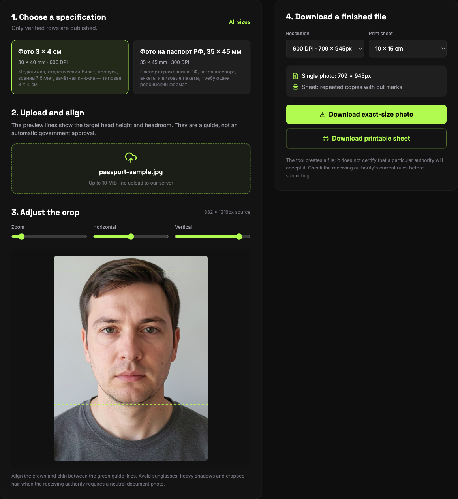

## What it solves

The photo you hand in with a document application is a pile of millimetre figures.

The two most common Russian formats are 3 × 4 cm — medical records, student IDs, passes, military IDs — and 35 × 45 mm, for passports and visa paperwork. It sounds simple until you actually have to crop one: how tall is the head, how much space above it, how white is the background, how many pixels are enough?

Search for any of those and every page gives a different answer.

Not because anyone is careless, but because these numbers live in sources of different ages that copy each other: a government page states one part, a photo studio's instructions state another, a visa agency copies both and rewords one. There is no way to tell which figure has a source behind it and which is something a person typed in passing.

So I did something deliberately dumb: **every number carries the sentence it appeared in.**

## What a row actually is

A row is not "3 × 4 = 30 × 40 mm". It is:

- size in millimetres
- a head-height band
- a headroom band (the space above the head)
- background colour
- minimum DPI
- which sheets it can be laid out on (10 × 15 cm, 4 × 6 in, A4)
- a status: `verified` / `single-source` / `disputed`
- and, for every figure, the source URL and the verbatim sentence

The first two rows came out like this:

**Фото 3 × 4 см** — 30 × 40 mm, head (to the top of the hair) 26 mm, 2–4 mm from the top edge to the hair, white background, at least 600 dpi.

**Фото на паспорт РФ, 35 × 45 мм** — 35 × 45 mm, head 32–36 mm (70–80% of the photo's height), 4–6 mm of headroom, white background, at least 300 dpi.

Behind each figure sits a sentence like this one:

> необходимо фото размером 30.00mm × 40.00mm с разрешением не менее 600 dpi. Фон должен быть белый, без посторонних предметов и теней.

Source, sentence, date read. The point is that **a stranger can re-read that sentence months later instead of trusting me.**

## Three rules

### One: a figure whose sentence cannot be read does not enter the table

This is the most important rule and the easiest one to break. A number shows up, it looks reasonable, it appears in several places — but if I cannot find the sentence itself, it does not go in.

### Two: a contradicting figure is not deleted — it stays, with the reason it lost

This is the counter-intuitive one.

One source puts the head height for 3 × 4 at **11–13 mm**. Three others say 26 mm. An 11–13 mm head inside a 40 mm frame is a third of the height, which no acceptance desk takes — and the same page says "не менее 70–80%" three entries above.

Normally you delete that as noise.

It is still in the table, with its source and a note on why it was rejected.

Because the next person re-reading that page will hit the same 11–13 mm and have the same moment of doubt. Shown only a clean table, they will assume the scrape was wrong or their reading was, and spend an afternoon re-deriving what I already derived. Left there with the reason, they reach the same conclusion in five seconds.

**A rejected judgement is still data; it is just a different shape.**

### Three: a row with a single source is not shipped

The table holds a third format: the newer 35 × 45 for application forms, head 25–30 mm, headroom 3 mm ± 1 mm.

Exactly one page describes it. The format is still being phased in and there is very little public material.

Its status is `single-source`, and it never appears on the live site — pages are generated only from `verified` rows.

The reason is plain: **one source is not evidence, it is a claim.** The same figure written independently in two unrelated places is what makes it dependable. That rule is hard, and it does not bend because a number looks sensible or because someone is impatient for that size.

## Where the photo goes

All of the above is about checking figures. The tool's half has one rule: **the photo does not go to a server.**

The file is read into a canvas through `FileReader`, cropped to the chosen spec, annotated with the head-height guide lines so you can check them yourself, laid out into a printable sheet, and downloaded directly with `canvas.toBlob`. No upload, no backend on this path, no account.

You can open the page, disconnect from the network, and it still works.

The reason for taking this seriously: **a document photo is the highest-stakes image most people ever handle.** It carries their face, their name usually sits elsewhere in the same application, and it exists in order to be handed to an institution. Making someone upload it to an unfamiliar server just to change its size is indefensible.

## What it does not do

Honesty beats a feature list:

- **It does not find your face.** You align the guide; it draws the head-height limits so you can check them.
- **The background is replaced with a flat colour, not segmented hair by hair.** Fine edges will not be perfect.
- **It will happily produce a photo that gets rejected for reasons it cannot see** — expression, glasses glare, shadows, a face turned slightly away. It is a layout tool, not a compliance oracle.
- **We do not claim "meets visa requirements".** Every desk adds its own rule. The tool can vouch for two things — the dimensions and the head proportion — against the source it quotes.

## Check it yourself

The cheapest test: print the exported sheet at 100% and measure it. 30 × 40 mm is 30 × 40 mm, and the top of the head sits inside a 4–6 mm band.

To check the figures themselves, every source link is in `source.yaml` and every sentence is in `evidence.json`, verbatim.
