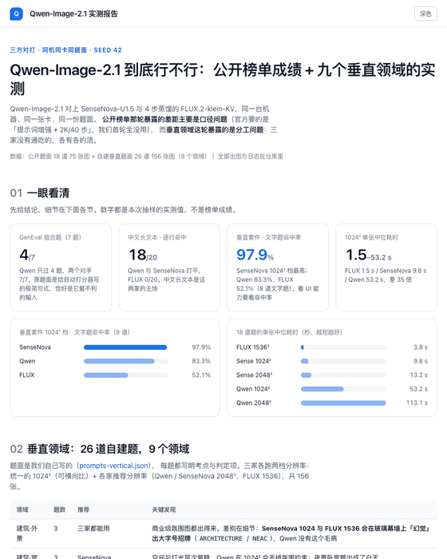
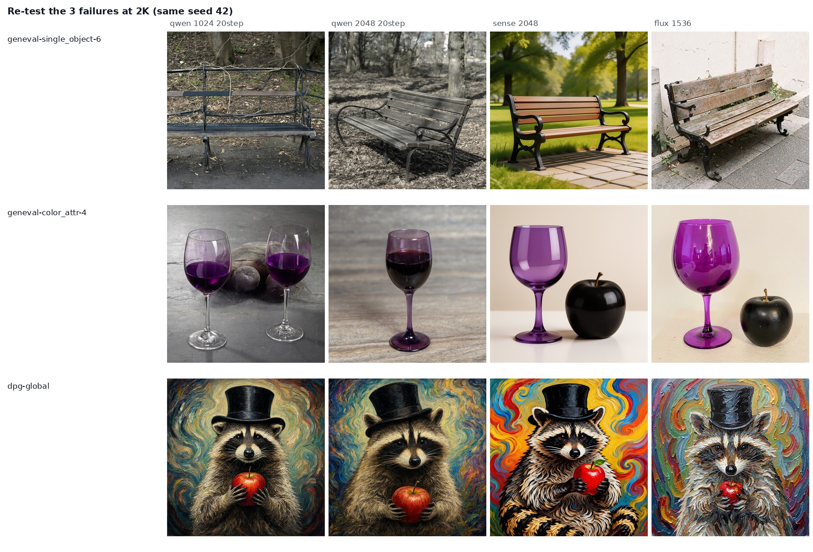
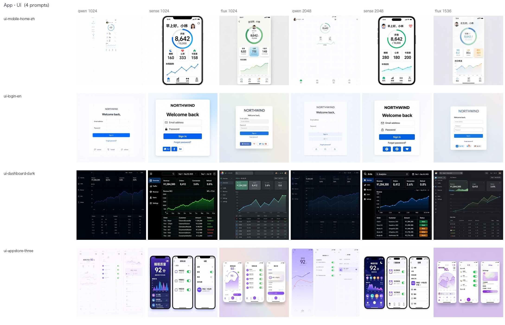

Qwen-Image-2.1 的官方 README 里有一句很容易被跳过的话：**推荐用官方的提示词增强模型，把短提示扩写成长描述**。而我们第一轮实测，一个参数都没按它来。

于是就有了一个很尴尬的结果：拿 GenEval 的原始题面去问它「画两个钟」，它只画一个钟。同机同卡同 seed 的另外两家，7 题全过。

这篇文章要说的是：**那个 4/7 不是能力上限，是我们喂题的姿势不对**；以及顺着这件事往下挖，为什么官方宣传的分数和实测的手感会对不上。

## 先说结论

差距主要不在模型，在**口径**。

官方的推荐管线是三件事叠在一起：**提示词增强器 + 2048² + 40 步**。我们首轮用的是**原始短题面 + 1024² + 20 步** —— 三样一样没占。把题面改写成增强器那种长描述之后，**两道丢物体的失败题当场都过了**，而同分辨率、同 seed、同机器，只动了题面这一个变量。

这件事有两层意思。第一层是它给「短请求不吃」：GenEval 的题面是为自动打分器设计的极简句式，恰好是这条推荐管线里最不利的输入形态。第二层是提醒：**拿公开榜单的分数去估实际体验，中间隔着一整套管线的默认值。**

## 首轮成绩单

三家拉到同一台机器、同一张卡、同一份题单上：题面一字未改，全部取自公开评测集（GenEval / DPG-Bench / LongText-Bench），同 seed。

| | Qwen-Image-2.1 | SenseNova-U1.5 | FLUX.2-klein-KV |
|---|---|---|---|
| 形态 | 7B DiT + Qwen3-VL 文本编码器，RGBA VAE | 8B+8B MoT，8 步 | 9B 蒸馏 + INT4 KV，4 步 |
| 1024² 单张（中位） | 52.1 s（20 步） | 9.8 s | **1.6 s** |
| 2048² 单张 | 102–111 s | **13 s** | 不支持（≤1536） |
| 文字渲染 / 字符准确率 | 74.6% | **86.5%** | 40.8% |
| 文字渲染 / 逐行命中 | 25/35 | **26/35** | 4/35 |
| 中文长文本逐行命中 | **18/20** | **18/20** | 0/20 |
| 英文长文本逐行命中 | 7/15 | **8/15** | 4/15 |
| GenEval 组合题（7 题） | **4/7** | 7/7 | 7/7 |
| DPG-Bench 长描述（4 题） | 2 好 / 2 有瑕疵 | **4 好** | **4 好** |
| 原生透明 RGBA | **✅ 独有** | ✗ | ✗ |

三家在同题上的并排：

Qwen 的三次翻车很具体：`a photo of two clocks` 只画一个钟；`a photo of a purple wine glass and a black apple` 把黑苹果整个丢掉；`a photo of a bench` 在 1024² 下结构崩坏。

但也有它独占的地盘：**中文长文本逐行命中 18/20，和 SenseNova 打平**，而 FLUX 是 0/20 —— 它的中文是整段乱码。另外**原生透明 RGBA 只有它支持**，要出透明背景的素材，这一条直接决定选它。

顺带一个值得记的失败形态：Qwen 在密集小字上会**凭空生成整段「看起来像英文但一个词都不对」的假字**。黑板菜单那题就是这样 —— 版面排得挺规整，凑近一看全是编的。

## 差距到底从哪来

| 差距来源 | 贡献 | 证据 |
|---|---|---|
| **缺官方提示词增强器，用的是原始短题面** | 最大 | 消融实验 2/2 修复 |
| **口径不同**：官方复合总分 vs 单点通过率 | 大 | 官方榜是总分，没有 GenEval / DPG 分项 |
| **对手不同**：INT4 蒸馏 4 步 vs 榜上满血 FLUX | 中 | 对打的 klein-KV 不在那张榜上 |
| **抽样与打分口径** | 中 | 每题 1 张、单 seed；组合题是人眼判读，不是 Mask2Former 自动打分 |
| **分辨率 / 步数** | 结构性失败大、文字类小 | 长椅 1K 崩、2K 正常；长文本指标没看到提升 |

第二条值得展开一句。官方博客那句「小模强效」，靠的是它自家的 **Qwen-Image-Bench 复合总分**，那是一张**总分榜，没有 GenEval / DPG 的分项**——和「7 题过 4 题」不是一个量纲，换算不过来。

而官方 README 自己写得很清楚：

> For best results, we recommend using the official **prompt rewriting models** to expand short prompts into detailed, high-quality descriptions.

默认参数也明写着 `num_inference_steps = 40`、`2048 × 2048`。**我们首轮一样都没按。**

### 只改题面，其余全不动

固定同一台机器、同一张卡、**2048²、20 步、seed 42**。唯一的变化：把 GenEval 的原题面改写成增强器风格的长描述。

- `a photo of two clocks` → 原题面**照旧只画一个钟**；长描述 → **正好两个**。
- `a photo of a purple wine glass and a black apple` → 原题面丢苹果；长描述 → **两个都在，颜色绑定也对**。

这里必须说明一句：右边的长描述是**人工模仿**增强器风格写的，**不是**官方增强器（一个微调过的 Qwen3.5-VL 9B 检查点）的真实输出，我们没部署它。所以这组对照证明的是「题面形态影响巨大」，不是「官方增强器一定能把分拉回来」。

### 但别把 2K / 40 步当万能药

把 4 道长文本题按官方配方（2048²/40 步）重跑，并加上 SenseNova 2048² 作对照：

| LongText-Bench 原题 | Qwen 1024²/20 步 | Qwen 2048²/40 步（官方配方） | SenseNova 2048² |
|---|---|---|---|
| 英文 / 黑板菜单 | 20.5% / 2/7 | 13.7% / 3/7 | 63.4% / 3/7 |
| 英文 / 音乐节海报 | 94.4% / 4/5 | 80.6% / 2/5 | 73.3% / 1/5 |
| 中文 / 幻灯片 | 81.5% / 12/12 | 81.1% / 12/12 | 76.9% / 11/12 |
| 中文 / 音乐节海报 | 90.2% / 3/5 | **98.6% / 4/5** | 97.3% / 4/5 |
| **平均（字符准确率 / 逐行命中）** | **71.7% / 72.4%** | **68.5% / 72.4%** | **77.7% / 65.5%** |

**文字渲染没有提升，代价却是 172 s/张，而 1024²/20 步是 52 s/张。**

一个诚实的限定：2K 图的字号更小、字体更花，OCR 跨分辨率并不完全可比（海报那张 94.4% → 80.6% 就是被字体风格吃掉的）。所以这里只能说「**没看到提升**」，不能反过来说 2K 更差。

而**结构性**失败确实是配置问题 —— 那把「一张长椅」在 1024² 崩了，2048² 正常：

**所以两条建议分开：想要组合题过关，关键在提示词增强，不在分辨率；想要文字写对，关键在模型本身，堆步数没用。**

## 换一套题：26 道垂直题面

公开榜单考的是通用能力，和「这单活到底该用哪个模型」对不上。所以另起了一套**自建题面**：9 个领域、26 道题，每题写明考点与判定项，三家各跑两档分辨率（统一 1024² 可横向比 + 各家推荐分辨率），一共 156 张。

| 领域 | 推荐 | 关键发现 |
|---|---|---|
| 建筑·外景 | 三家都能用 | SenseNova 1024 和 FLUX 1536 **会在玻璃幕墙上幻觉出大字号招牌**；Qwen 没这毛病 |
| 建筑·室内 | **SenseNova** | 空间与灯光层次最稳。Qwen 在 1024² 会丢氛围约束：夜景卧室出成了白天 |
| 人像 | **SenseNova**（特写）/ 三家都行（合影） | 老人特写的皮肤细节差距最大：SenseNova 是照片级，Qwen 明显更平滑 |
| App·UI | **SenseNova** | 只有它在 1024² 就把中文界面写对 |
| 商品·电商 | 三家都可用 | Qwen 1024² 漏了「两只瓶子」，但标签文字它最准 |
| 游戏·图标 | **Qwen**（单个） | 单个图标三家都是商业级；**「12 个风格一致的线性图标」三家全崩** |
| 动漫·二次元 | Qwen / SenseNova（FLUX 出局） | 番剧海报的中文主标题、副标题、播出信息、制作署名，Qwen 与 SenseNova 全写对；FLUX 整行乱码 |
| 漫画·分镜 | **SenseNova** | 四格漫画：只有它把四句中文台词**放进对应画格** |
| 插画·绘本 | **SenseNova** | 水墨那题 Qwen 两档都「太淡」：留白过头，山体几乎看不见 |

App·UI 那一组最能说明「看榜单选不出模型」：

Qwen 在 1024² 会把整张 mockup **缩成中间一小块并留幽灵重影**，到 2048² 才恢复（文字逐行命中 5/12 → 11/12，字符准确率 63.0% → 86.4%）。而 SenseNova 在这个尺寸上本来就是 12/12。

四格漫画那组则示范了另一件事 —— 同一张图，两个指标说的不是一回事：

Qwen 把四句台词**都写出来了**（逐行命中 4/4），但**配到了错的画格**、还夹着乱码，所以字符准确率只有 34.8%。SenseNova 是 100% / 4/4。**命中率回答「话说了没」，字符准确率回答「字对不对」——这道题必须两个一起看。**

### 耗时

| 首轮 18 题中位 | Qwen-Image-2.1 | SenseNova-U1.5 | FLUX.2-klein-KV |
|---|---|---|---|
| 1024² | 53.2 s | 9.8 s | **1.5 s** |
| 各家推荐分辨率 | 113.1 s（2048²） | 13.2 s（2048²） | **3.8 s**（1536²） |

后面补的 8 道垂直题**不在上表里，也不能拿来比**：跑它们的时候 3 号卡被农场任务占着，Qwen 那臂改到借来的卡上、并全程用了更省显存的 `sequential` offload 档，单张 97 s（1024²）/ 208 s（2048²），是首轮 `model` 档的近 2 倍。offload 只改权重换进换出的时机、不改采样计算，同 seed 下出图质量不受影响，但**耗时不可比**，所以单独排除。

## 已知局限，请连同结论一起看

- 每题**只出 1 张、单 seed**。这是抽样体检，不是榜单成绩；n=4~7 的时候，±1 题就是 ±14%。
- 组合题与长描述题**由人眼判读**，不是官方 GenEval 的 Mask2Former / DPG 的 mPLUG+CLIP 自动打分。
- 消融臂的「长描述」是人工写的替身，不是官方增强器的真实输出。
- 三家**没跑在完全相同的步数上**（Qwen 20 / SenseNova 8 / FLUX 4）。这是「各自最佳配置」的口径，不是「同预算」的口径。
- 垂直套件那 26 道题是**自建**的，不是公开榜单；它是选型参考，同样每题只出 1 张。
- 对打的 FLUX 是 **INT4 蒸馏 4 步**的部署版，不是榜单上的满血 FLUX 2 Pro / Max。

## 如果你只想要一份结论

- 要出**效果图 / 人像 / UI 稿 / 漫画分镜** → SenseNova，而且它 1024² 就能用，比 Qwen 快 5 倍以上
- 要出**番剧海报的大标题**、或要**透明背景 PNG** → Qwen，这两项它独占
- 用 Qwen 出**组合复杂**的画面 → 先上提示词增强，别用极简句式硬问
- 要**成套且严格一致的多元素**（比如 12 个图标） → 三家都别指望，老老实实后期对齐
- **别拿榜单总分估算实际出图体验** —— 中间隔着一整套管线的默认值

题面原文、逐题出图、耗时与 OCR 分数全部公开在 [qwen-image-2.1-bench](https://github.com/wangsheng1991/qwen-image-2.1-bench)，也有一份[网页版报告](https://wangsheng1991.github.io/qwen-image-2.1-bench/)和[复现脚本](https://github.com/wangsheng1991/qwen-image-2.1-bench/tree/main/scripts)。
