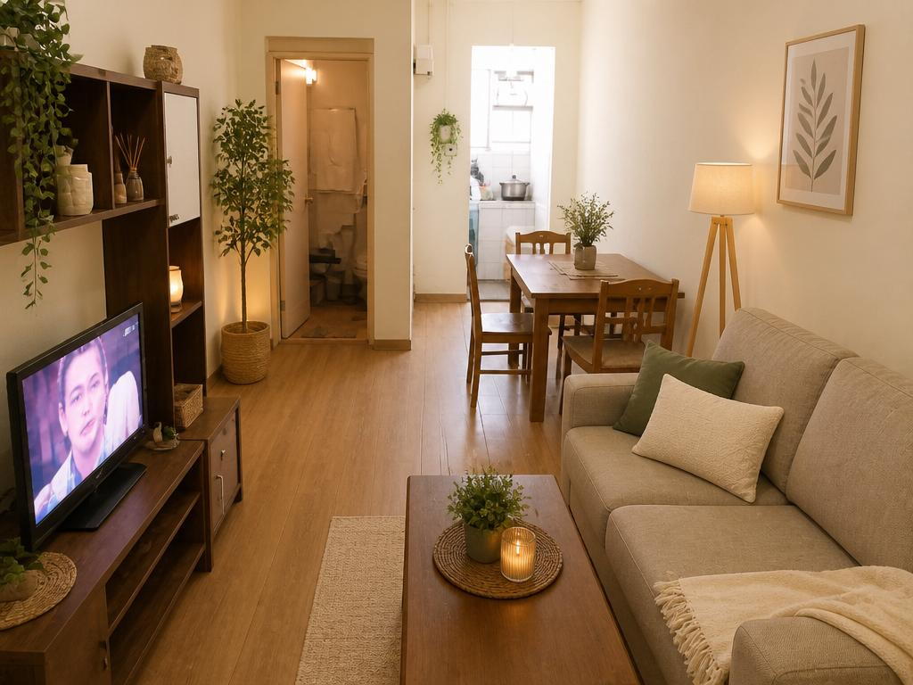
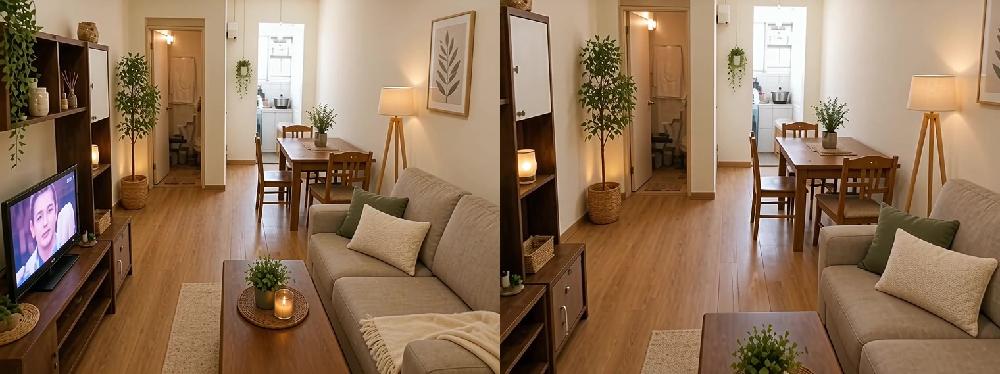

One 1024×768 interior render, one motion prompt, and five seconds later a clip you can actually publish. This is the easiest rung of image-to-video, and the one we took in June when we needed marketing footage for RenVi.

The short version: **the model is fine. Two parameter defaults are not.**



## What we actually got back

| | Measured |
|---|---|
| Model | `wan2.6-i2v-flash` |
| Input | one render, inlined as a data URI |
| Request | `resolution: 720P`, `duration: 5` |
| Output | **1108×830, 5.007 s, H.264, ~5.5 MB** |
| Audio track | **yes — AAC stereo, 44.1 kHz** |
| Cost for that one clip | **¥1.50** (should have been ¥0.75) |

That AAC track was not something we asked for. It is what happens when nobody tells the model not to. The next three sections are those three parameters.

Here are the first and last frames side by side — five seconds of one slow push-in:



## 1. `audio` defaults to on, and it exactly doubles the price

The API reference says this about `audio`:

> 可选值：true：默认值，输出有声视频。false：输出无声视频。

And the pricing page lists that same model as **¥0.3/second with sound and ¥0.15/second without** at 720P; ¥0.5 and ¥0.25 at 1080P.

So **omitting `audio` bills you for sound**. Five seconds of 720P with audio is ¥1.50; without it, ¥0.75. The extra yuan buys an AI ambience track you had no intention of using.

That is exactly how our batch was billed: all three clips came back with a track, because the script's `parameters` object carried only `resolution` and `duration`. The reproduction script now defaults to `audio: false`, and sound has to be asked for with `--audio true`.

## 2. `resolution` is a pixel budget, not a quality switch — and it defaults to 1080P

This sentence from the docs is worth reading twice:

> 模型根据选择的分辨率档位，自动缩放至相近总像素，视频宽高比将尽量与输入图像 img_url 的宽高比保持一致。

So "720P" does not hand you 1280×720. Our input was 4:3 (1024×768) and the output was **1108×830** — 919,600 pixels against 1280×720's 921,600. It gives you that many pixels and follows your image's shape; it does not crop to 16:9.

The bigger problem is the next line in the same table: for `wan2.6-i2v-flash`, **`resolution` defaults to 1080P**. Leave it out and you pay 1080P rates even when your input is 1024 pixels wide and cannot possibly carry 1080P detail.

## 3. `duration` is any integer from 2 to 15, not a 5-or-10 choice

Most write-ups about image-to-video say "5 seconds or 10 seconds". That is `wan2.6-i2v-us`. For the flash tier the reference reads:

> 取值为[2, 15]之间的整数。默认值为 5。

Seven seconds, nine, thirteen — all fine, all billed linearly by the second. For a product page, "one still, pushed in slowly for twelve seconds" looks far better than cutting to the next slide at five, and it still costs by the second.

## The API has one mode: asynchronous

There is no synchronous call. The request must carry `X-DashScope-Async: enable`; without it you get `current user api does not support synchronous calls`, as the docs put it — 「HTTP 请求只支持异步，必须设置为 enable」.

You poll on the returned `task_id`, and there are six states: `PENDING`, `RUNNING`, `SUCCEEDED`, `FAILED`, `CANCELED`, `UNKNOWN`. **`UNKNOWN` does not mean "not ready yet" — it means the task does not exist.** Task IDs are kept for 24 hours, and so are result URLs:

> 链接有效期 24 小时，可通过此 URL 下载视频。视频格式为 MP4（H.264 编码）。

So "submit it, go do something else, download it later" dies overnight. The script polls to completion and writes the file immediately — not out of tidiness, but because the URL is gone by morning.

## Reproducing it

The script is in this repository, zero dependencies, Node plus the DashScope HTTP API:

```bash
export QWEN_API_KEY=sk-...     # or DASHSCOPE_API_KEY
node scripts/wan-i2v.mjs \
  --image room.jpg \
  --prompt "slow cinematic dolly-in through the cozy renovated living room, gentle smooth camera motion, soft warm natural light, photorealistic, stable, no people" \
  --resolution 720P --duration 5 \
  --log run.json
```

- `--audio` defaults to `false` (the cheap tier); add `--audio true` when you want sound
- The image is read from disk and inlined as a data URI — no object storage, nothing published to the open internet first
- Polls every 8 seconds, up to 40 times; **a timeout and a `FAILED` both exit non-zero rather than leaving an empty file behind**
- Writes `task_id`, poll count, elapsed time and file size into `run.json`

The measurement log for our batch is in [research/wan-i2v/measured-2026-09-22.json](https://github.com/wangsheng1991/content-engine/blob/main/research/wan-i2v/measured-2026-09-22.json) — every clip carries a sha256, so dimensions, duration, audio track and byte count can all be recomputed.

## The four parameters, and what to do with them

| Parameter | Default | Use | Why |
|---|---|---|---|
| `audio` | `true` | write `false` explicitly | ¥0.15/s silent against ¥0.3/s with sound at 720P — exactly double |
| `resolution` | `1080P` | match the input's real pixel count | ¥0.15/s at 720P against ¥0.25/s at 1080P; a 1024-wide input pays for pixels that are not there |
| `duration` | `5` | any integer 2–15, chosen for the shot | billed per second, so give the move as long as it needs |
| `watermark` | `false` | leave it | commercial footage should not carry an "AI generated" corner mark |

## Where this chain stops

- **It works** for turning a still you already like into a short clip with camera movement — product pages, social, render-to-video. A few mao to a bit over a yuan per clip.
- **It does not** do long video or multi-shot narrative (that is `shot_type: multi`, a different tier), and it will not rescue a bad image. The input sets the ceiling; the model only adds movement.
- **One real limit**: our first frame was an AI-generated render. A real photograph works too, but the room's structure and perspective move with it — when you see metal reflections or lighting that ignores the lamp, the fix is a smaller motion, not a longer prompt.

Five seconds, seventy-five fen. At that price you can produce one clip per style instead of carefully choosing a single hero shot — and for marketing assets, the supply of variants moves the needle more than the polish of any one of them.
